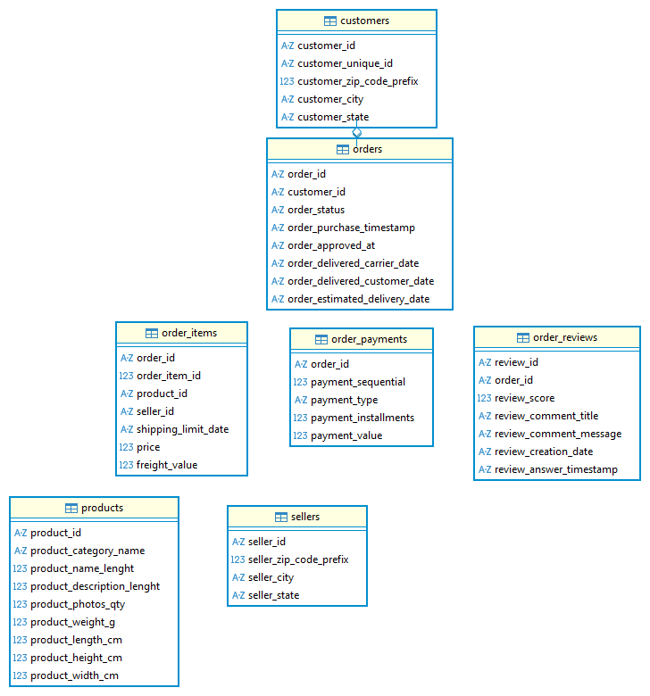

# 電商智慧推薦系統

# Smart E-Commerce Recommendation System

> 透過 SQL、機器學習與推薦系統，分析電商訂單資料與使用者行為資料，逐步打造一個可展示的電商智慧分析與推薦系統。

---

## 1. 專案簡介

本專案是我的機器學習 Side Project，目標是從真實電商資料出發，練習完整的資料產品開發流程。

目前已完成第一個核心里程碑：**Olist SQL 與商業分析**。

本階段已將 Olist 的 9 個 CSV 檔案匯入 MySQL，並透過 Python、PyMySQL、Pandas、Jupyter Notebook 完成基本資料檢查、資料表理解、ERD 繪製與 7 個基礎商業分析查詢。

後續會在這個基礎上繼續發展：

```text
Kaggle 資料集 
↓
資料匯入 MySQL ✅ 已完成
↓
SQL 查詢與商業分析  ✅ 已完成基礎版
↓
EDA 視覺化
↓
機器學習模型訓練
↓
RFM 顧客分群
↓
推薦系統建立
↓
FastAPI 後端 API
↓
AJAX 前端串接
↓
Dashboard 與作品集展示
```

---

## 2. 專案名稱

中文名稱：

```text
電商智慧推薦系統
```

英文名稱：

```text
Smart E-Commerce Recommendation System
```

GitHub Repository 建議名稱：

```text
smart-ecommerce-recommendation-system
```

---

## 3. 目前專案進度

| 階段 | 任務 | 狀態 |
|---|---|---|
| Stage 1 | 建立專案與資料管理 | In Progress |
| Stage 2 | Olist SQL 與商業分析 | Completed |
| Stage 3 | Olist EDA 視覺化 | Next |
| Stage 4 | Olist 機器學習 | Not Started |
| Stage 5 | Olist Dashboard | Not Started |
| Stage 6 | Retailrocket 使用者行為分析 | Not Started |
| Stage 7 | 推薦系統 Baseline | Not Started |
| Stage 8 | FastAPI 推薦 API | Not Started |
| Stage 9 | AJAX 前端展示 | Not Started |

---

## 4. 已完成成果：Olist SQL 與商業分析

### 4.1 已完成項目

- 成功將 Olist 9 個 CSV 檔案匯入 MySQL
- 可以使用 PyMySQL 在 Jupyter Notebook 查詢 MySQL 資料
- 完成每張表的欄位與商業意義整理
- 完成 Olist 核心 ERD 圖
- 完成 7 個基礎 SQL 商業分析查詢

### 4.2 已匯入 MySQL 的資料表

| 資料表 | 說明 |
|---|---|
| `customers` | 顧客資料 |
| `orders` | 訂單主表 |
| `order_items` | 訂單商品明細 |
| `order_payments` | 訂單付款資料 |
| `order_reviews` | 訂單評論資料 |
| `products` | 商品資料 |
| `sellers` | 賣家資料 |
| `geolocation` | 地理位置資料 |
| `product_category_name_translation` | 商品類別英文翻譯表 |

### 4.3 Olist Core ERD

本專案已完成 Olist 核心資料表關係圖。



核心資料關係：

```text
customers.customer_id
        ↓
orders.customer_id

orders.order_id
        ↓
order_items.order_id

orders.order_id
        ↓
order_payments.order_id

orders.order_id
        ↓
order_reviews.order_id

order_items.product_id
        ↓
products.product_id

order_items.seller_id
        ↓
sellers.seller_id

products.product_category_name
        ↓
product_category_name_translation.product_category_name
```

---

## 5. 已完成 SQL 商業分析題目

目前已完成以下 7 個基礎 SQL 分析查詢：

| 編號 | 分析題目 | 分析目的 |
|---|---|---|
| 1 | 總訂單數 | 了解整體訂單規模 |
| 2 | 不同訂單狀態數量 | 了解訂單流程與異常狀態分布 |
| 3 | 每月訂單數 | 觀察訂單成長趨勢與季節性 |
| 4 | 每月營收 | 分析營收趨勢 |
| 5 | 最熱賣商品類別 | 找出主要銷售品類 |
| 6 | 評價分數分布 | 了解顧客滿意度概況 |
| 7 | 各州顧客數 | 分析顧客地理分布 |

### 5.1 商業分析方向

這些查詢對應到電商營運中的幾個核心問題：

- 訂單量是否穩定成長？
- 哪些訂單狀態最常見？是否有大量取消或不可用訂單？
- 營收是否跟訂單數同步成長？
- 哪些商品類別是主要銷售來源？
- 顧客評價整體偏好還是偏差？
- 顧客主要集中在哪些州？

---

## 6. 使用資料集

## 6.1 Brazilian E-Commerce Public Dataset by Olist

資料集來源：

```text
https://www.kaggle.com/datasets/olistbr/brazilian-ecommerce
```

### 資料集定位

Olist 是巴西電商平台的公開訂單資料，主要適合用來練習：

- SQL 多表 JOIN
- 訂單分析
- 商品品類分析
- 付款分析
- 物流延遲分析
- 評論分數分析
- 訂單是否延遲預測
- 評論好壞預測
- RFM 顧客分群
- 商業 Dashboard

### 使用資料檔案

```text
olist_orders_dataset.csv
olist_order_items_dataset.csv
olist_order_payments_dataset.csv
olist_order_reviews_dataset.csv
olist_customers_dataset.csv
olist_products_dataset.csv
olist_sellers_dataset.csv
olist_geolocation_dataset.csv
product_category_name_translation.csv
```

---

## 6.2 Retailrocket Recommender System Dataset

資料集來源：

```text
https://www.kaggle.com/datasets/retailrocket/ecommerce-dataset
```

Retailrocket 是電商使用者行為資料，包含使用者對商品的互動事件，適合用來練推薦系統。

主要事件包含：

```text
view
addtocart
transaction
```

未來會使用 Retailrocket 建立：

- 熱門商品推薦
- 其他人也看了
- 其他人也加入購物車
- 其他人也買了
- 個人化推薦
- 推薦 API
- AJAX 前端串接

---

## 7. 技術棧

| 類別 | 技術 |
|---|---|
| 程式語言 | Python, SQL, JavaScript |
| 資料處理 | Pandas, NumPy |
| 資料庫 | MySQL |
| Python 連線 MySQL | PyMySQL, SQLAlchemy |
| SQL 工具 | DBeaver, MySQL Workbench |
| Notebook | Jupyter Notebook |
| 資料視覺化 | Matplotlib, Plotly, Streamlit |
| 機器學習 | Scikit-learn |
| 推薦系統 | Co-occurrence Matrix, Cosine Similarity, Collaborative Filtering |
| 後端 API | FastAPI |
| 前端串接 | HTML, CSS, JavaScript, AJAX |
| 版本控制 | Git, GitHub |

---

## 8. 專案資料夾結構

目前專案結構規劃如下：

```text
smart-ecommerce-recommendation-system/
│
├── README.md
├── requirements.txt
├── .gitignore
│
├── data/
│   ├── README.md
│   ├── raw/
│   │   ├── olist/
│   │   └── retailrocket/
│   ├── processed/
│   └── sample/
│
├── notebooks/
│   ├── 01_olist_data_overview.ipynb
│   ├── 02_olist_sql_analysis.ipynb
│   └── 03_olist_business_analysis.ipynb
│
├── sql/
│   ├── 01_create_database.sql
│   ├── 02_basic_check.sql
│   └── 03_business_analysis.sql
│
├── scripts/
│   ├── load_olist_to_mysql.py
│   └── db_config.py
│
├── reports/
│   └── images/
│       └── olist_core_erd.png
│
├── src/
│   ├── data_processing/
│   ├── features/
│   ├── models/
│   └── recommenders/
│
├── api/
│   └── main.py
│
├── frontend/
│   ├── index.html
│   ├── product.html
│   ├── app.js
│   └── style.css
│
├── dashboard/
│   └── streamlit_app.py
│
└── models/
    └── README.md
```

---

## 9. Data 下載與放置方式

本專案不直接上傳完整 Kaggle 原始資料。請自行從 Kaggle 下載資料後放到本機指定資料夾。

### 9.1 Olist Dataset

下載來源：

```text
https://www.kaggle.com/datasets/olistbr/brazilian-ecommerce
```

放置位置：

```text
data/raw/olist/
```

預期結構：

```text
data/raw/olist/
├── olist_orders_dataset.csv
├── olist_order_items_dataset.csv
├── olist_order_payments_dataset.csv
├── olist_order_reviews_dataset.csv
├── olist_customers_dataset.csv
├── olist_products_dataset.csv
├── olist_sellers_dataset.csv
├── olist_geolocation_dataset.csv
└── product_category_name_translation.csv
```

### 9.2 Retailrocket Dataset

下載來源：

```text
https://www.kaggle.com/datasets/retailrocket/ecommerce-dataset
```

放置位置：

```text
data/raw/retailrocket/
```

預期結構：

```text
data/raw/retailrocket/
├── events.csv
├── item_properties_part1.csv
├── item_properties_part2.csv
└── category_tree.csv
```

---

## 10. 安裝方式

```bash
git clone https://github.com/your-username/smart-ecommerce-recommendation-system.git

cd smart-ecommerce-recommendation-system

python -m venv .venv
```

啟動虛擬環境：

```bash
# macOS / Linux
source .venv/bin/activate

# Windows
.venv\Scripts\activate
```

安裝套件：

```bash
pip install -r requirements.txt
```

---

## 11. MySQL 設定

請先在本地端 MySQL 建立資料庫：

```sql
CREATE DATABASE IF NOT EXISTS olist_ecommerce
CHARACTER SET utf8mb4
COLLATE utf8mb4_unicode_ci;

USE olist_ecommerce;
```

接著在 `scripts/db_config.py` 設定 MySQL 連線資訊：

```python
DB_CONFIG = {
    "host": "localhost",
    "port": 3306,
    "user": "root",
    "password": "your_password",
    "database": "olist_ecommerce",
    "charset": "utf8mb4"
}
```

> 注意：`db_config.py` 內可能包含密碼，不建議上傳到 GitHub。

---

## 12. 執行方式

### 12.1 匯入 Olist CSV 到 MySQL

```bash
python scripts/load_olist_to_mysql.py
```

### 12.2 啟動 Jupyter Notebook

```bash
jupyter notebook
```

### 12.3 未來啟動 FastAPI

```bash
uvicorn api.main:app --reload
```

### 12.4 未來啟動 Streamlit Dashboard

```bash
streamlit run dashboard/streamlit_app.py
```

---

## 13. 建議 `.gitignore`

```gitignore
# Python
__pycache__/
*.py[cod]
.ipynb_checkpoints/

# Virtual environment
.venv/
venv/
env/

# Environment variables
.env

# Config with local credentials
scripts/db_config.py

# Raw and processed data
data/raw/
data/processed/

# Large data files
*.csv
*.zip
*.parquet
*.db
*.sqlite
*.pkl
*.joblib

# Allow sample data
!data/sample/
!data/sample/*.csv

# Cache and system files
.cache/
.DS_Store
```

---

## 14. Roadmap

### Stage 1：建立專案與資料管理

- 建立 GitHub Repository
- 建立資料夾結構
- 建立 `.gitignore`
- 保留 Kaggle 原始資料於本機 `data/raw/`
- 撰寫 README

### Stage 2：Olist SQL 與商業分析 ✅

- 查看所有 Olist CSV
- 匯入 MySQL
- 使用 PyMySQL 在 Notebook 查詢 MySQL
- 理解每張表的商業意義
- 繪製 Olist ERD
- 完成 7 個基礎 SQL 商業分析查詢

### Stage 3：Olist EDA 視覺化

下一步會把 SQL 查詢結果轉成圖表，建立更完整的商業分析 Notebook。

預計分析：

- 每月訂單數趨勢圖
- 每月營收趨勢圖
- Top 10 商品類別長條圖
- 評價分數分布圖
- 各州顧客數分布圖
- 訂單狀態分布圖

### Stage 4：Olist 機器學習

預計任務：

- 訂單延遲預測
- 評論好壞預測
- RFM 顧客分群

### Stage 5：Olist Dashboard

預計使用 Streamlit 建立互動式 Dashboard：

- 總營收
- 總訂單數
- 平均客單價
- 月營收趨勢
- 商品品類排行
- 評論分數分布
- 顧客地理分布

### Stage 6：Retailrocket 推薦系統

預計使用 Retailrocket 使用者行為資料建立推薦功能：

- 熱門商品推薦
- 其他人也看了
- 其他人也加入購物車
- 其他人也買了
- 個人化推薦

### Stage 7：FastAPI + AJAX 展示

預計將推薦結果包成 API，並用前端頁面展示推薦結果。

---

## 15. 預期成果展示

最終希望能展示三個成果：

### 15.1 電商商業分析 Dashboard

- 總營收
- 總訂單數
- 平均客單價
- 商品品類排行
- 物流延遲率
- 評論分數分布
- 顧客分群結果

### 15.2 機器學習預測模型

- 訂單延遲預測
- 評論好壞預測
- 顧客 RFM 分群

### 15.3 商品推薦系統

- 熱門商品推薦
- 其他人也看了
- 其他人也加入購物車
- 其他人也買了
- 個人化推薦
- FastAPI + AJAX 前端展示

---

## 16. License

This project is for learning and portfolio purposes.

Dataset ownership and usage rights belong to the original Kaggle dataset providers. Please follow the license and terms of each dataset on Kaggle.
