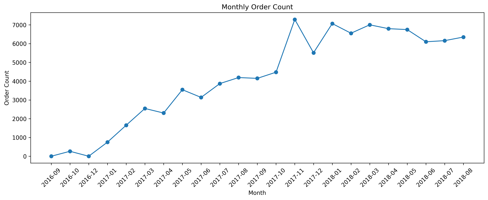
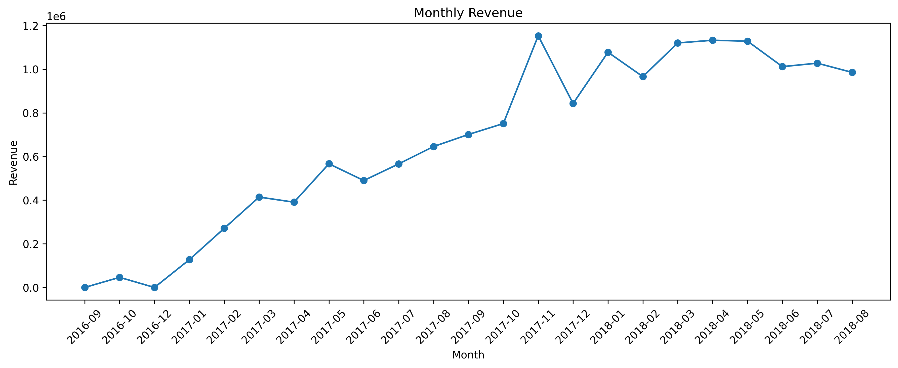
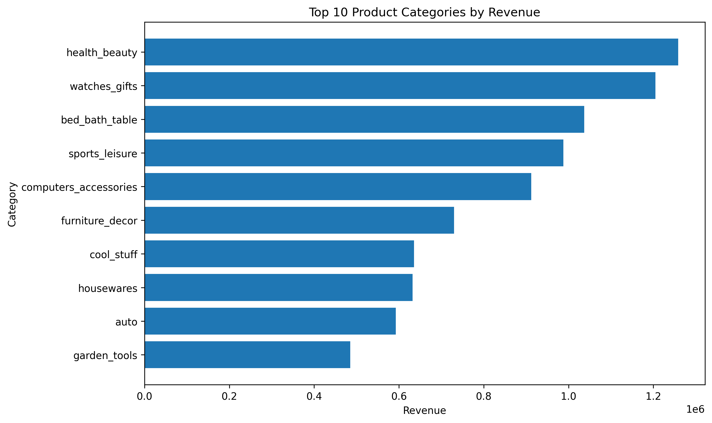
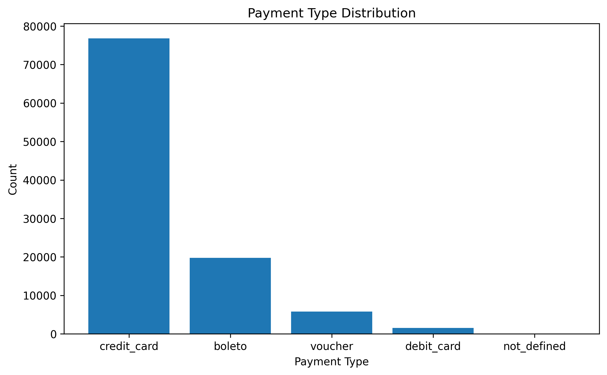
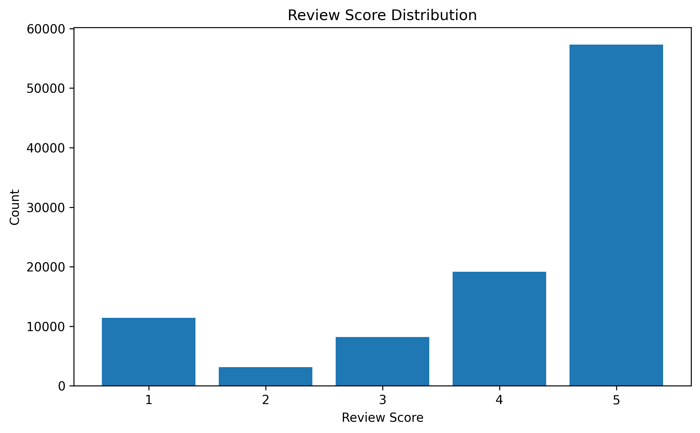
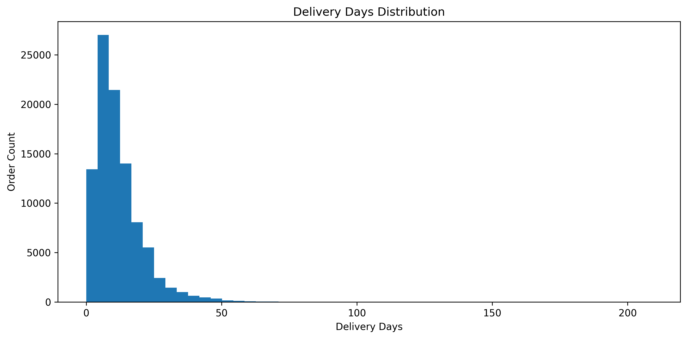
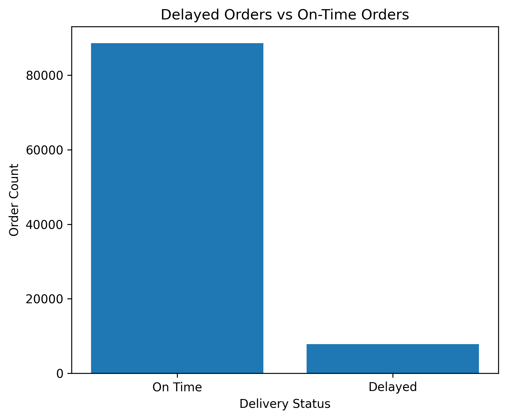
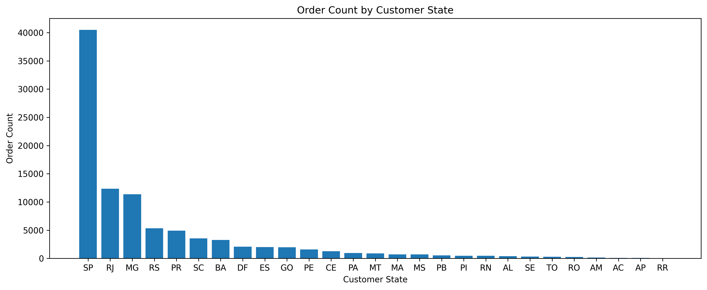

# 電商智慧推薦系統

Smart E-Commerce Recommendation System

本專案以電商資料分析與推薦系統為主軸，使用 **Olist Brazilian E-Commerce Dataset** 與 **Retailrocket Recommender System Dataset**，逐步完成從資料匯入、SQL 分析、商業 EDA、機器學習預測、推薦系統，到後續 API 與前端展示的完整資料產品流程。

目前專案已完成：

- Stage 1：Olist 資料認識與環境建立
- Stage 2：Olist SQL 基礎查詢
- Stage 3：Olist 商業分析 EDA 初版

下一步將進入：

- Stage 4：Olist 訂單是否延遲預測

---

## 專案目標

本專案的目標不是單純訓練一個模型，而是練習完整的資料產品開發流程：

```text
資料集下載
↓
資料清理與資料庫設計
↓
SQL 查詢與商業分析
↓
EDA 視覺化分析
↓
機器學習模型
↓
推薦系統
↓
FastAPI 後端 API
↓
AJAX 前端串接
↓
Dashboard 與作品集展示
```

---

## 使用資料集

### 1. Olist Brazilian E-Commerce Dataset

Olist 資料集主要用於電商訂單與商業分析。

適合分析：

- 訂單數趨勢
- 營收趨勢
- 商品品類營收
- 付款方式分布
- 評論分數分布
- 物流配送天數
- 延遲訂單比例
- 顧客地區分布
- 後續延遲預測與評論預測模型

### 2. Retailrocket Recommender System Dataset

Retailrocket 資料集主要用於推薦系統與使用者行為分析。

適合分析：

- 商品瀏覽行為
- 加入購物車行為
- 購買行為
- 熱門商品推薦
- Item-to-Item 推薦
- 個人化推薦系統
- 推薦 API 串接

---

## 目前專案資料夾結構

目前專案以 Olist SQL 與商業 EDA 為主，因此保留核心分析資料夾。後續進入推薦系統與 API 階段時，再逐步新增 `src/`、`api/`、`frontend/`、`dashboard/` 等資料夾。

```text
smart-ecommerce-recommendation-system/
│
├── README.md
├── requirements.txt
├── .gitignore
│
├── data/
│   ├── README.md
│   ├── raw/
│   │   ├── olist/
│   │   └── retailrocket/
│   ├── processed/
│   └── sample/
│
├── docs/
│   └── olist_core_erd.png
│
├── notebooks/
│   ├── 01_olist_data_overview.ipynb
│   ├── 02_olist_sql_analysis.ipynb
│   └── 03_olist_business_analysis.ipynb
│
├── reports/
│   └── images/
│       ├── olist_monthly_order_count.png
│       ├── olist_monthly_revenue.png
│       ├── olist_top10_categories_revenue.png
│       ├── olist_payment_type_distribution.png
│       ├── olist_review_score_distribution.png
│       ├── olist_delivery_days_distribution.png
│       ├── olist_delayed_orders.png
│       └── olist_customer_state_order_count.png
│
├── scripts/
│   ├── load_olist_to_mysql.py
│   ├── db_config.py
│   └── db_config_example.py
│
└── sql/
    ├── 01_create_database.sql
    ├── 02_basic_check.sql
    └── 03_business_analysis.sql
```

---

## 資料夾說明

| 資料夾 / 檔案 | 說明 |
|---|---|
| `data/raw/olist/` | Olist 原始 CSV 資料 |
| `data/raw/retailrocket/` | Retailrocket 原始資料 |
| `docs/` | 專案文件與 ERD 圖，目前放置 Olist 核心資料表 ERD |
| `notebooks/` | Jupyter Notebook 分析流程 |
| `reports/images/` | EDA 圖表輸出，供 README 與作品集展示使用 |
| `scripts/` | 資料匯入與資料庫連線設定 |
| `sql/` | MySQL 建表、檢查與商業分析 SQL |
| `requirements.txt` | Python 套件需求 |
| `.gitignore` | Git 忽略規則 |

---

## 目前完成進度

### Stage 1：Olist 資料認識與環境建立

已完成：

- 下載 Olist 資料集
- 建立專案資料夾結構
- 整理原始資料放置位置
- 使用 Python 載入 CSV
- 匯入 Olist 資料到 MySQL
- 使用 DBeaver 檢查資料表
- 建立初步 ERD 圖
- 理解主要資料表之間的關係

主要資料表：

- `orders`
- `order_items`
- `order_payments`
- `order_reviews`
- `customers`
- `products`
- `sellers`
- `geolocation`
- `product_category_name_translation`

ERD 圖位置：

```text
docs/olist_core_erd.png
```

---

### Stage 2：Olist SQL 基礎分析

已完成：

- 查詢總訂單數
- 查詢各訂單狀態數量
- 查詢銷售額最高商品
- 查詢商品品類營收
- 計算平均客單價 AOV
- 練習多表 JOIN
- 使用 Notebook 執行 SQL 查詢
- 將 SQL 分析整理於 `02_olist_sql_analysis.ipynb`

相關檔案：

```text
notebooks/02_olist_sql_analysis.ipynb
sql/02_basic_check.sql
```

---

### Stage 3：Olist 商業分析 EDA

目前 Stage 3 已完成 EDA 初版。

主要 Notebook：

```text
notebooks/03_olist_business_analysis.ipynb
```

SQL 查詢整理：

```text
sql/03_business_analysis.sql
```

EDA 圖表輸出位置：

```text
reports/images/
```

本階段完成以下分析：

- 每月訂單數趨勢
- 每月營收趨勢
- Top 10 商品品類營收
- 付款方式分布
- 評論分數分布
- 物流配送天數分布
- 延遲訂單比例
- 各州顧客訂單分布

---

## Stage 3：EDA 成果展示

### 1. 每月訂單數趨勢



分析目的：

觀察 Olist 平台每月訂單量變化，判斷平台交易量是否有成長趨勢、季節性波動或異常月份。

商業意義：

訂單數可以反映平台需求變化，但需要與營收與平均客單價一起比較，才能判斷成長品質。

---

### 2. 每月營收趨勢



分析目的：

觀察每月營收變化，並與每月訂單數趨勢互相比較。

商業意義：

若營收與訂單數同步上升，代表交易規模擴大；若訂單數上升但營收沒有同步增加，可能代表客單價下降。

---

### 3. Top 10 商品品類營收



分析目的：

找出平台主要營收來源品類，判斷營收是否集中在少數商品類別。

商業意義：

高營收品類可以作為平台重點經營方向，例如加強庫存、廣告投放與推薦曝光。

---

### 4. 付款方式分布



分析目的：

了解顧客主要使用哪些付款方式。

商業意義：

付款方式會影響結帳流程設計、分期付款策略與付款失敗風險管理。

---

### 5. 評論分數分布



分析目的：

觀察顧客評價分布，了解整體滿意度狀況。

商業意義：

評論分數可作為顧客體驗指標，也能作為後續 Stage 5 評論好壞預測模型的基礎。

---

### 6. 物流配送天數分布



分析目的：

了解訂單從下單到實際送達所需天數，觀察是否存在極端延遲案例。

商業意義：

配送速度是電商顧客體驗的重要因素，配送時間過長可能造成差評或取消訂單。

---

### 7. 延遲訂單比例



分析目的：

計算有多少訂單晚於預估送達日期。

商業意義：

延遲訂單比例是後續 Stage 4「訂單是否延遲預測」的重要基礎，可以直接轉換成機器學習 Label。

Label 設計：

```text
order_delivered_customer_date > order_estimated_delivery_date
→ delayed = 1

否則
→ delayed = 0
```

---

### 8. 各州顧客訂單分布



分析目的：

了解 Olist 顧客訂單主要集中在哪些州。

商業意義：

高訂單州別可以作為物流倉儲、行銷投放與區域營運策略的重要依據。

---

## Stage 3 商業洞察總結

透過本階段 EDA，可以初步掌握 Olist 平台的營運狀況：

1. **訂單與營收趨勢**  
   每月訂單數與每月營收可以用來判斷平台整體交易規模是否穩定成長。

2. **商品品類營收集中度**  
   Top 10 商品品類營收可以看出平台主要收入來源，後續可以進一步分析各品類的訂單數、平均售價、運費與評論表現。

3. **付款方式偏好**  
   付款方式分布可以反映顧客的結帳習慣，協助後續優化付款流程與分期付款策略。

4. **顧客滿意度**  
   評論分數分布可以作為顧客滿意度的初步指標，後續可延伸為評論好壞預測模型。

5. **物流配送效率**  
   配送天數分布與延遲訂單比例可以用來衡量物流效率，是後續延遲預測模型的核心分析方向。

6. **地區需求分布**  
   各州顧客訂單分布可以看出市場需求集中區域，後續可進一步分析跨州配送是否影響配送天數與延遲率。

---

## 安全設定說明

本專案使用 `scripts/db_config.py` 管理本機 MySQL 連線設定。

由於 `db_config.py` 可能包含資料庫帳號與密碼，因此不建議上傳至 GitHub。

建議做法：

```text
上傳：
scripts/db_config_example.py

不上傳：
scripts/db_config.py
```

`.gitignore` 建議加入：

```gitignore
scripts/db_config.py
```

`db_config_example.py` 範例：

```python
DB_CONFIG = {
    "user": "your_mysql_user",
    "password": "your_mysql_password",
    "host": "localhost",
    "port": 3306,
    "database": "olist_ecommerce",
    "charset": "utf8mb4"
}
```

---

## 使用技術

目前已使用：

- Python
- Pandas
- Matplotlib
- SQLAlchemy
- PyMySQL
- MySQL
- DBeaver
- Jupyter Notebook
- Git / GitHub

後續預計使用：

- Scikit-learn
- XGBoost / LightGBM
- Streamlit
- FastAPI
- JavaScript
- AJAX

---

## 下一步規劃

### Stage 4：訂單是否延遲預測

下一階段將進入第一個機器學習分類模型，目標是預測訂單是否會延遲送達。

預計流程：

1. 建立 `delayed` label
2. 整理特徵資料表
3. 處理缺失值與類別欄位
4. 切分訓練集與測試集
5. 訓練第一版分類模型
6. 評估模型表現
7. 分析哪些因素最容易造成延遲

預計使用特徵：

- 商品價格
- 運費
- 付款方式
- 分期數
- 商品品類
- 顧客州別
- 賣家州別
- 下單月份
- 下單星期幾
- 預估配送天數
- 商品重量
- 商品尺寸

---

## 目前專案狀態

```text
Stage 1：Olist 資料認識與環境建立       ✅ 已完成
Stage 2：Olist SQL 基礎查詢             ✅ 已完成
Stage 3：Olist 商業分析 EDA             ✅ 初版完成
Stage 4：訂單是否延遲預測               ⬜ 尚未開始
Stage 5：評論好壞預測                   ⬜ 尚未開始
Stage 6：RFM 顧客分群                   ⬜ 尚未開始
Stage 7：Streamlit Dashboard            ⬜ 尚未開始
Stage 8：Retailrocket EDA                ⬜ 尚未開始
Stage 9：熱門商品推薦                   ⬜ 尚未開始
Stage 10：其他人也看了                  ⬜ 尚未開始
Stage 11：其他人也加入購物車             ⬜ 尚未開始
Stage 12：其他人也買了                  ⬜ 尚未開始
Stage 13：個人化推薦                    ⬜ 尚未開始
Stage 14：FastAPI 推薦 API              ⬜ 尚未開始
Stage 15：AJAX 前端串接                 ⬜ 尚未開始
```
